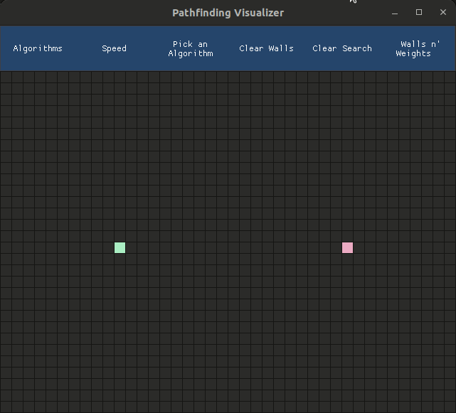
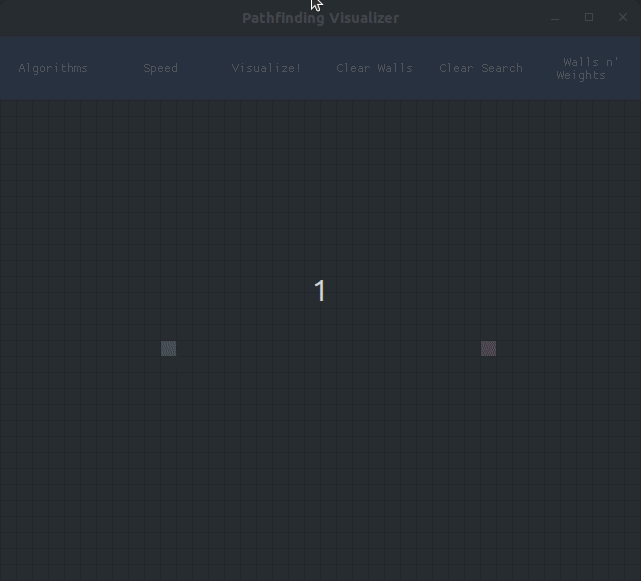
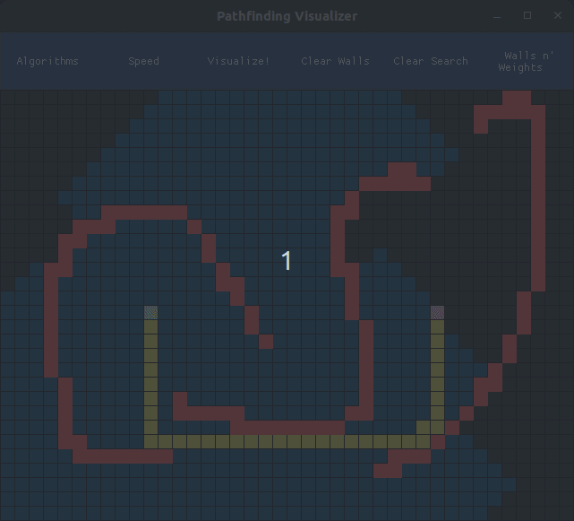

# Pathfinding Visualizer
A user interface to allow for visualization of various pathfinding algorithms.
This project is not yet complete I intend to add more pathing algorithms and 
the ability to add more end nodes.

## Draw on screen with mouse 
Click to add/remove a cell, or drag to keep drawing walls or weights.
All cells are animated.

## Searching 
When searching a animation showing the current cell that is being visited is shown.

## Clearing the Grid
You can clear walls and/or the previous search to run a new one

